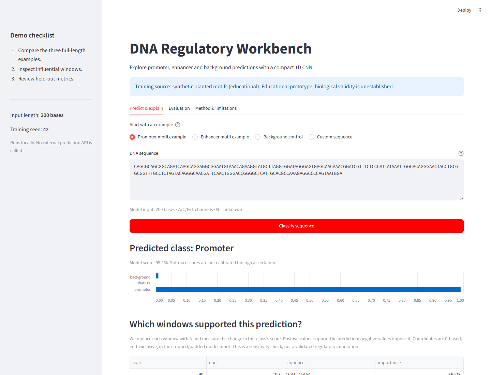
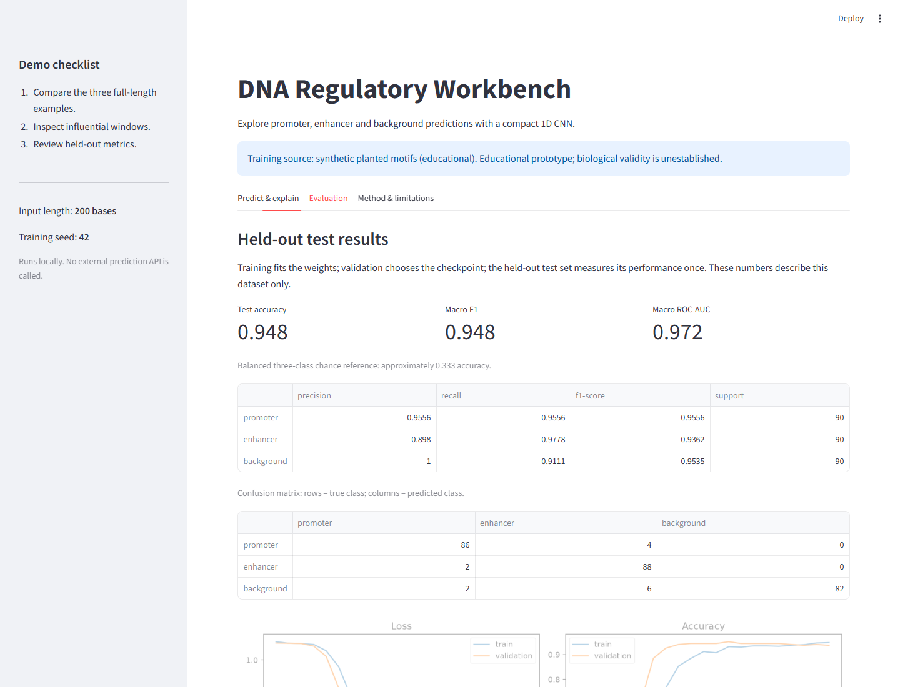

# Recorded local demo validation

Validated on **5 October 2026**, on Windows with Python 3.13.0, TensorFlow 2.21.0,
Streamlit 1.65.0, NumPy 2.5.3 and scikit-learn 1.9.1. This is a recorded run, not a
guaranteed score for every environment. Machine-readable results and model/data
hashes are saved in [demo-results.json](demo-results.json).

## Synthetic training run

`python -m dna_classifier.cli prepare-demo` generated 1,800 sequences, each 200 bases
long: 600 per class. Seed 42 produced 1,260 training, 270 validation and 270 test
inputs, with equal class counts in each split. Training ran for 21 of the allowed
30 epochs; the lowest-validation-loss checkpoint was used for the final test.

| Held-out metric | Result |
| --- | --- |
| Accuracy | 0.948148 (256/270 correct) |
| Macro precision | 0.951172 |
| Macro recall | 0.948148 |
| Macro F1 | 0.948405 |
| One-vs-rest macro ROC-AUC | 0.972263 |

All three full-length UI examples generated with independent seed 2026 were
classified according to their planted labels. They were not selected by searching
for successful predictions. This is a small demonstration, not external validation.

## Checks completed

- **48 automated tests passed**, including a real one-epoch TensorFlow
  train/save/load/predict/evaluate round trip and failed-fit artifact preservation.
- Ruff lint and formatting checks passed; `git diff --check` passed.
- Windows `run-local.ps1 -PrepareOnly` succeeded; subsequent launch reused the
  environment without dependency downloads and reused the validated model.
- The actual local server returned `ok` at `/_stcore/health`.
- Headless Chrome checked promoter/enhancer/background examples, invalid-base
  errors, all-N rejection, padding warnings, all three tabs, and both JSON downloads.
- The classification control remained usable at a 390-pixel mobile viewport.
- Starting another server on occupied port 8501 failed with a clear corrective message.
- Re-evaluating `data/processed/test.csv` reproduced these metrics and saved reports
  to `artifacts/evaluation/`, preserving the original training report.

TensorFlow/Keras emitted upstream informational and NumPy deprecation warnings
during the tests; they did not prevent training, saving, loading or predictions.
Linux/Codespaces hosting has updated setup and LF shell scripts, but was not run
locally on this Windows machine. GitHub Actions supplies the Linux test check.

## Screenshots from the running app

## Scientific boundary

These measurements describe a planted-motif generator. They do not establish
performance on human genomic data, tissue-specific regulatory activity or causal
function. No calibrated confidence analysis, baseline comparison, chromosome-based
split, repeated-seed study or external biological validation has been completed.
